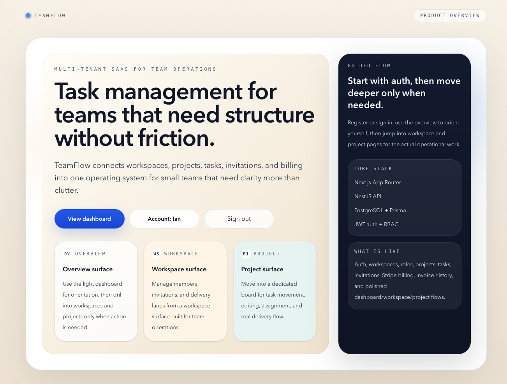
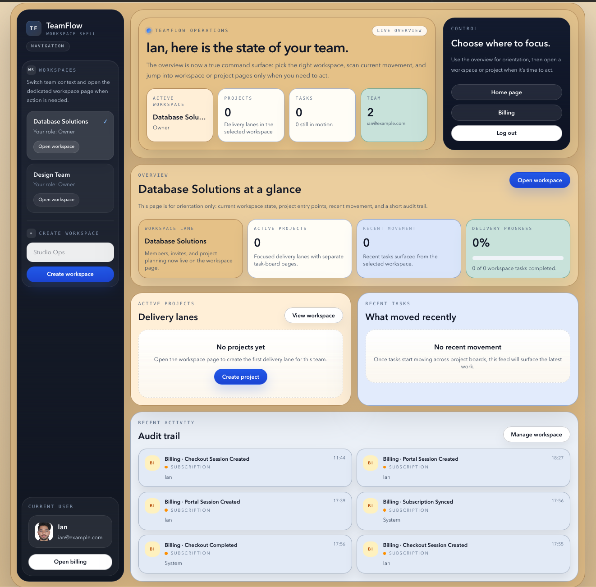
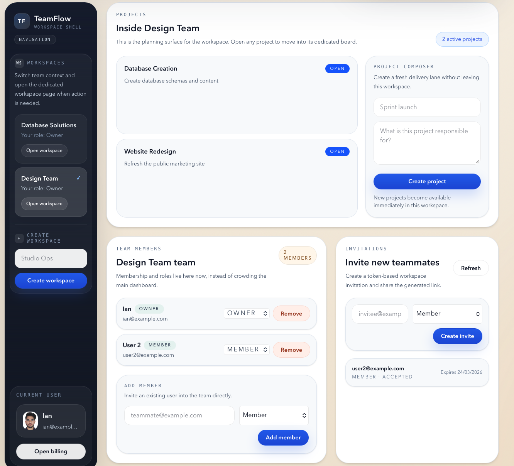
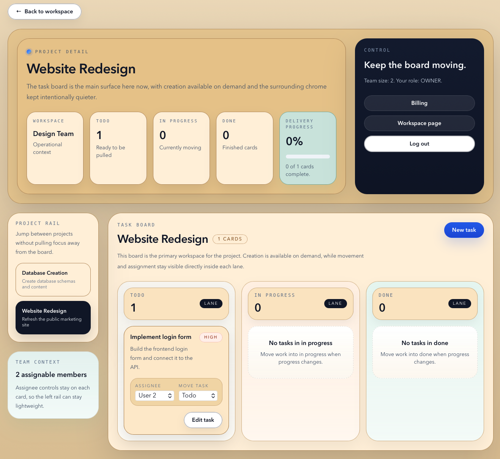
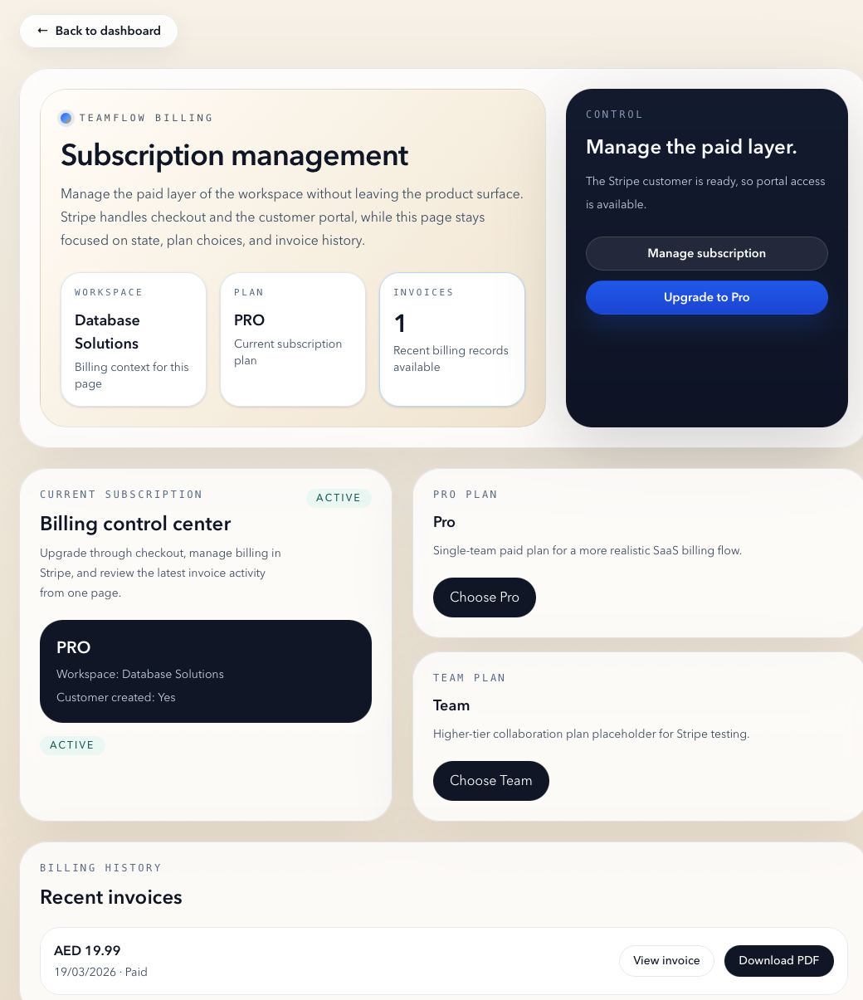
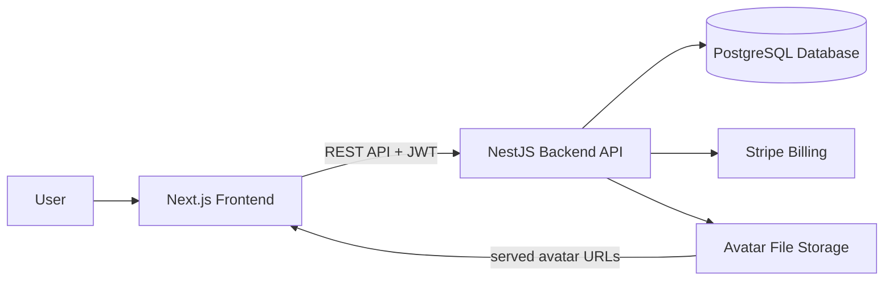

# TeamFlow

I built TeamFlow as a full-stack SaaS workspace platform for teams that need structure across projects, tasks, memberships, billing, and account management.

This repository is a monorepo containing:

- a NestJS backend API
- a Next.js frontend application
- Prisma/PostgreSQL data persistence
- Stripe billing integration

## What The Product Does

Right now, TeamFlow supports:

- user registration and login
- account management with avatar upload and removal
- multi-workspace collaboration
- role-based memberships
- project creation and planning
- task creation, editing, assignment, and board movement
- invitation flows
- workspace audit history
- Stripe checkout, customer portal, and invoice history

## Stack

- Frontend: Next.js App Router, React, TypeScript, Tailwind CSS
- Backend: NestJS, TypeScript
- Database: PostgreSQL
- ORM: Prisma
- Authentication: JWT
- Billing: Stripe
- Local infrastructure: Docker Compose

## Main Dependencies

- `next`
- `react`
- `tailwindcss`
- `@nestjs/*`
- `@prisma/client`
- `prisma`
- `passport-jwt`
- `stripe`
- `multer`

## Repository Structure

```text
teamflow-saas-platform/
├── backend/              NestJS API, Prisma schema, migrations, backend tests
├── frontend/             Next.js app, page shells, UI components
├── docs/                 planning and progress PDFs/markdown
├── docker-compose.yml    local PostgreSQL service
└── .env.example          shared environment template
```

## Product Areas

### Authentication And Account

- register and login
- signed-in landing page behavior
- account page for name updates and avatar upload/remove

### Workspace Operations

- create and switch workspaces
- manage members and roles
- invite teammates
- review workspace-level audit history

### Project And Task Execution

- create projects inside workspaces
- view project boards on dedicated project pages
- create, edit, assign, and move tasks

### Billing

- create Stripe checkout sessions
- access the Stripe customer portal
- view invoice history and subscription state

## Product Showcase

### Landing Page


Landing page introduces the product, shows signed-in or signed-out actions, and routes users into the main app flow.

### Dashboard Overview


Dashboard overview acts as the orientation surface for workspaces, recent movement, and high-level operational context.

### Workspace Management


Workspace page brings together members, invitations, and project creation without overloading the overview screen.

### Project Board


Project board is the main execution surface for creating tasks, assigning work, and moving cards across delivery lanes.

### Billing


Billing page keeps subscription state, checkout, customer portal access, and invoice history inside the product surface.

## Features

### Core Features

- JWT-based authentication
- account management with profile avatar upload/remove
- dedicated dashboard, workspace, and project surfaces
- responsive frontend shell system

### Collaboration Features

- multi-workspace support
- role-based membership management
- invitations and workspace onboarding
- project and task execution flows
- audit history for workspace activity

### Billing Features

- Stripe checkout
- Stripe customer portal
- invoice history
- subscription state handling

## Folder Guide

### `backend/`

I organized the backend by feature module rather than by a single global controller/service split.

Main backend areas:

- `src/auth/` auth, profile, JWT guards, current-user endpoints
- `src/workspaces/` workspaces, members, and role enforcement
- `src/projects/` project creation and retrieval
- `src/tasks/` task creation, editing, assignment, and board actions
- `src/invitations/` workspace invitation lifecycle
- `src/audit-logs/` audit event capture and retrieval
- `src/billing/` Stripe checkout, portal, invoices, webhook sync
- `src/prisma/` Prisma service and integration module
- `prisma/` database schema and migrations
- `test/` backend end-to-end coverage

More detail: [backend/README.md](/Users/iangonsalves/Documents/Github/teamflow-saas-platform/backend/README.md)

### `frontend/`

I organized the frontend around route surfaces and shared page-shell components.

Main frontend areas:

- `src/app/` route entry points
- `src/components/` feature panels and page shells
- `src/components/dashboard/` dashboard-specific building blocks
- `src/components/shell/` shared page-shell primitives
- `src/components/ui/` shared UI helpers like toasts and skeletons
- `src/lib/` API and auth-storage helpers

More detail: [frontend/README.md](/Users/iangonsalves/Documents/Github/teamflow-saas-platform/frontend/README.md)

## How The System Fits Together

I split TeamFlow into two main applications:

- `frontend/` renders the product UI: landing page, auth, dashboard, workspace pages, project boards, billing, and account management
- `backend/` owns the business logic, database access, file upload handling, billing integration, and API endpoints consumed by the frontend

The main flow looks like this:

1. The frontend sends authenticated requests to the backend API.
2. The backend validates permissions and business rules through Nest modules and services.
3. Prisma maps those operations to PostgreSQL.
4. Stripe is used by the backend billing module and surfaced through the frontend billing UI.
5. Uploaded avatars are stored by the backend and then rendered by the frontend using the saved file URL.

## Architecture Principles

- I kept the backend feature-based, with each domain owning its controller, service, DTOs, and tests
- I used a shared shell system on the frontend so dashboard, workspace, project, billing, auth, and account pages feel like one product
- I kept frontend and backend intentionally separated so product surfaces can evolve independently from backend domain logic

## Key Feature Implementation

### Authentication

- backend issues JWTs through Nest auth flows
- frontend stores auth session state and adapts the landing page and product navigation accordingly

### Workspace And RBAC

- memberships are enforced in backend services and guards
- frontend workspace views adapt around the active workspace context

### Projects And Tasks

- projects live inside workspaces
- tasks are created, edited, assigned, and moved through dedicated project surfaces

### Billing

- backend creates Stripe checkout and customer-portal sessions
- frontend billing surfaces consume that state and expose invoices and subscription actions

### Account Management

- frontend account page uploads avatar files
- backend stores the uploaded asset path and returns the saved profile state

## Demo Flow

If I need to walk someone through the product quickly, this is the clearest flow:

1. Register or sign in from the landing page.
2. Open the dashboard overview to show the anchored shell and workspace context.
3. Create a workspace or switch into an existing workspace.
4. Add a member or create an invitation from the workspace page.
5. Create a project from the workspace surface.
6. Open the project page and create a task.
7. Assign the task and move it across board lanes.
8. Open billing to show subscription management, Stripe portal access, and invoice history.
9. Open the account page to show profile editing and avatar upload/remove.

## Running Locally

I still kept local setup here for anyone who wants to clone the project and run it manually.

### 1. Start PostgreSQL

From the repository root:

```bash
docker compose up -d db
```

### 2. Backend

```bash
cd backend
npm install
cp ../.env.example .env
npx prisma generate
npx prisma migrate dev
npm run prisma:seed
npm run start:dev
```

### 3. Frontend

In a separate terminal:

```bash
cd frontend
npm install
cp ../.env.example .env.local
npm run dev
```

### Local URLs

- Frontend: `http://localhost:3000`
- Backend API: `http://localhost:3001/api`
- Swagger: `http://localhost:3001/docs`

## Available Scripts

Common commands across the repo:

- backend: `npm run start:dev`, `npm run build`, `npm run test`, `npm run test:e2e`
- backend data: `npm run prisma:seed`
- frontend: `npm run dev`, `npm run build`, `npm run lint`, `npm run start`

## Deployment Notes

- I would deploy the frontend to Vercel, the backend API to Render, and use Supabase for PostgreSQL plus avatar storage
- the backend can be deployed to Render from [backend/Dockerfile](/Users/iangonsalves/Documents/Github/teamflow-saas-platform/backend/Dockerfile)
- the frontend should point to the deployed backend API through `NEXT_PUBLIC_API_URL`
- backend production envs should include database, JWT, Stripe, frontend URL, and Supabase storage values

## Architecture Diagram


